# 学习笔记平台设计文档

## 项目概述

学习笔记平台是一个个人使用的笔记管理和分享系统，支持 Markdown 格式的笔记创建、编辑、标签分类和搜索功能。系统设计为从本地/内网环境开始的 MVP，并提供清晰的云端部署升级路径。

### 核心价值主张
- **简洁高效**：专注于笔记的创建、组织和检索
- **渐进式部署**：从本地开发到云端生产的平滑迁移
- **现代化技术栈**：基于 Next.js 14 的全栈解决方案
- **扩展性强**：模块化设计支持未来功能迭代

### 目标用户
- 个人学习者和知识工作者
- 需要组织和分享学习笔记的开发者
- 追求简洁高效笔记系统的用户

## 功能架构

### MVP 核心功能
1. **笔记管理**
   - 创建、编辑、删除 Markdown 笔记
   - 支持代码高亮和数学公式
   - 自动生成文章 slug
   
2. **组织与检索**
   - 标签系统支持多标签分类
   - 全文搜索（标题、内容、标签）
   - 按更新时间排序
   
3. **内容展示**
   - 笔记列表页面
   - 文章详情页面
   - 响应式设计支持移动端
   
4. **用户界面**
   - 浅色/深色主题切换
   - 管理后台界面
   - 简洁的导航结构

### 未来扩展功能
- 用户认证系统 (NextAuth)
- 图片/附件上传 (Supabase Storage)
- RSS 订阅支持
- 草稿功能
- 分类系统
- Mermaid 图表支持
- 评论系统
- PWA 支持
- 快捷键操作

## 技术架构

### 技术栈选型

| 组件 | 技术 | 理由 |
|------|------|------|
| 前端框架 | Next.js 14 (App Router) | 全栈一体、SSR/SSG、部署友好 |
| 数据库 | Prisma + SQLite(开发)/PostgreSQL(生产) | 类型安全、迁移便捷 |
| Markdown 解析 | react-markdown + remark-gfm + rehype-highlight | 功能完整、扩展性强 |
| 样式框架 | Tailwind CSS | 快速开发、暗色模式支持 |
| 部署平台 | Vercel | 零配置部署、边缘计算 |
| 云数据库 | Supabase/Neon PostgreSQL | 托管服务、可扩展 |

### 系统架构图

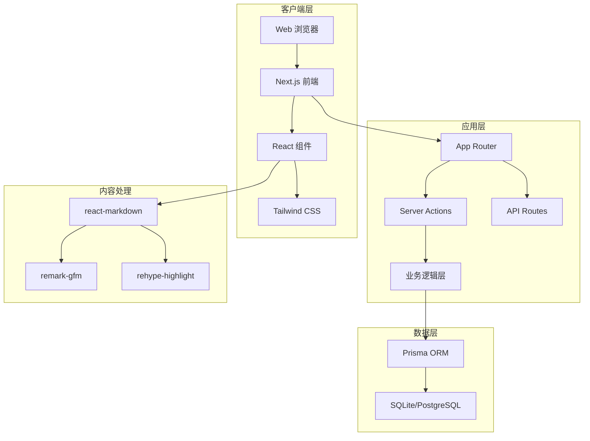

### 数据模型设计

#### 核心实体关系

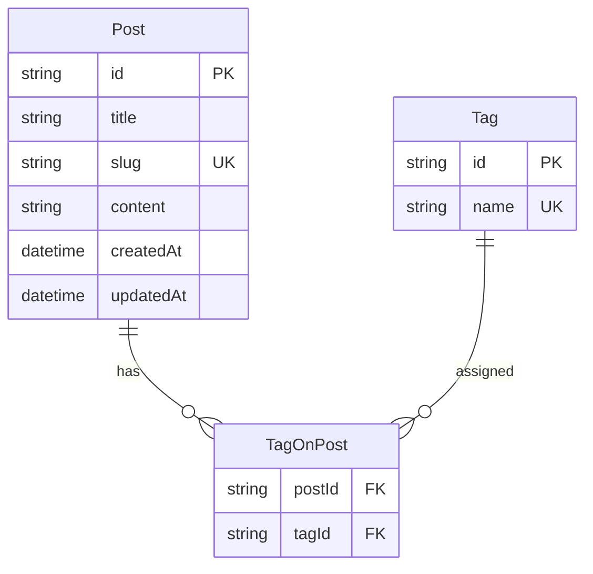

#### 数据模型说明

**Post 实体**
- `id`: 主键，使用 CUID 生成
- `title`: 笔记标题，用于显示和 SEO
- `slug`: URL 友好的标识符，自动从标题生成
- `content`: Markdown 格式的笔记内容
- `createdAt`: 创建时间戳
- `updatedAt`: 最后更新时间戳

**Tag 实体**
- `id`: 主键，使用 CUID 生成
- `name`: 标签名称，唯一约束

**TagOnPost 关联表**
- 实现 Post 和 Tag 的多对多关系
- 复合主键 (postId, tagId)

## 应用架构设计

### 目录结构

```
study-notes/
├── app/                          # Next.js App Router
│   ├── (blog)/                   # 博客路由组
│   │   └── page.tsx             # 首页列表
│   ├── post/[slug]/             # 动态路由
│   │   └── page.tsx             # 文章详情页
│   ├── dashboard/               # 管理后台
│   │   ├── new/                 # 新建笔记
│   │   └── edit/[id]/           # 编辑笔记
│   ├── layout.tsx               # 根布局
│   └── globals.css              # 全局样式
├── lib/                         # 工具库
│   ├── prisma.ts               # 数据库客户端
│   └── utils.ts                # 工具函数
├── prisma/                      # 数据库配置
│   └── schema.prisma           # 数据模型
└── components/                  # 可复用组件
    ├── ui/                     # 基础UI组件
    └── forms/                  # 表单组件
```

### 组件架构

#### 核心组件层次

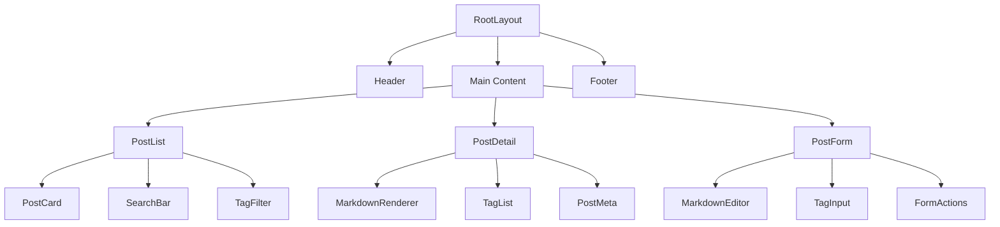

#### 组件职责定义

**布局组件**
- `RootLayout`: 应用根布局，包含导航和主要结构
- `Header`: 顶部导航栏，包含站点标题和快速操作
- `Footer`: 页脚信息（可选）

**列表页组件**
- `PostList`: 笔记列表容器组件
- `PostCard`: 单个笔记卡片，显示标题、摘要、标签、时间
- `SearchBar`: 搜索输入框，支持实时搜索
- `TagFilter`: 标签筛选器

**详情页组件**
- `PostDetail`: 文章详情容器
- `MarkdownRenderer`: Markdown 内容渲染器
- `TagList`: 标签列表显示
- `PostMeta`: 文章元信息（时间、标签）

**表单组件**
- `PostForm`: 笔记创建/编辑表单
- `MarkdownEditor`: Markdown 编辑器
- `TagInput`: 标签输入组件
- `FormActions`: 表单操作按钮

### 路由设计

#### 路由映射表

| 路径 | 组件 | 功能 | 权限 |
|------|------|------|------|
| `/` | HomePage | 笔记列表和搜索 | 公开 |
| `/post/[slug]` | PostDetail | 文章详情页 | 公开 |
| `/dashboard` | Dashboard | 管理面板 | 需认证 |
| `/dashboard/new` | NewPost | 创建新笔记 | 需认证 |
| `/dashboard/edit/[id]` | EditPost | 编辑笔记 | 需认证 |
| `/api/posts` | API Route | 笔记 CRUD 操作 | 需认证 |
| `/api/tags` | API Route | 标签管理 | 需认证 |

#### 导航流程

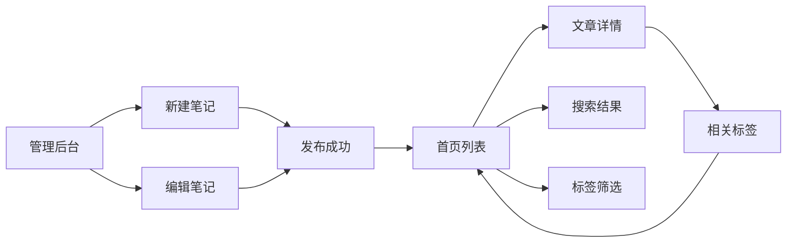

## 业务逻辑设计

### 笔记管理流程

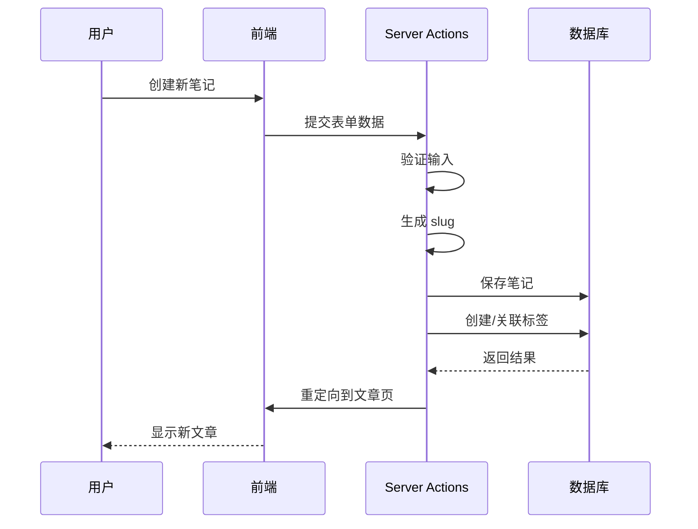

### 搜索与筛选逻辑

**搜索策略**
1. **关键词匹配**: 在标题和内容中进行模糊匹配
2. **标签筛选**: 精确匹配标签名称
3. **组合搜索**: 支持关键词和标签的组合查询
4. **结果排序**: 按更新时间降序排列

**搜索实现流程**

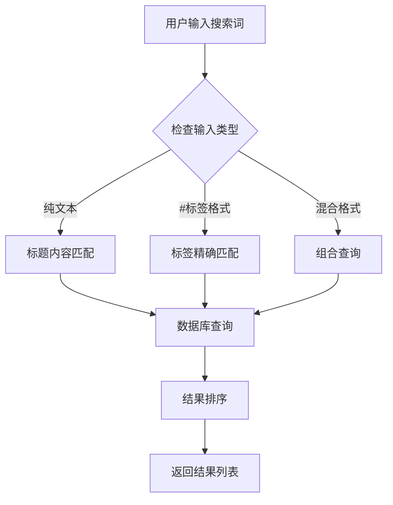

### 标签管理逻辑

**标签创建策略**
- 自动创建：输入新标签时自动在数据库中创建
- 去重处理：相同名称标签复用已有记录
- 批量关联：一篇文章可关联多个标签

**标签输入处理**

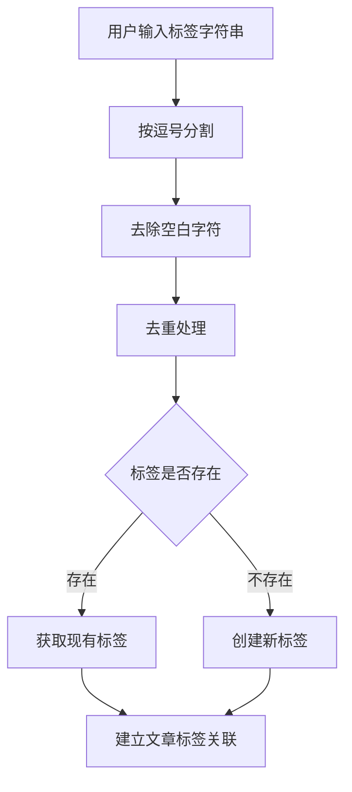

### Slug 生成逻辑

**生成规则**
1. 转换为小写
2. 替换空格和特殊字符为连字符
3. 移除非字母数字字符
4. 去重：如果 slug 已存在，添加随机后缀

**冲突处理策略**

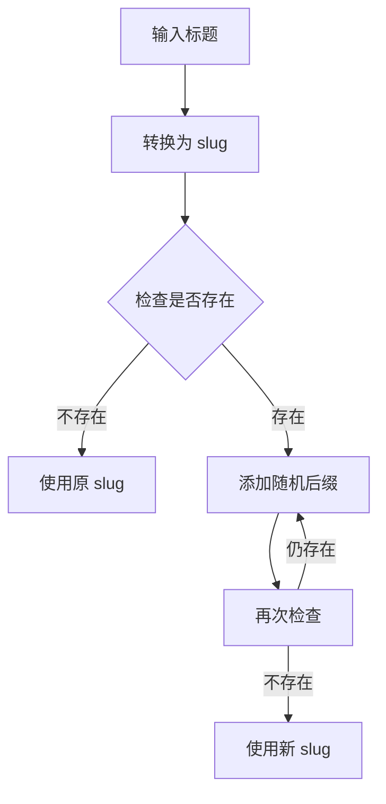

## 用户界面设计

### 设计系统

#### 颜色方案

| 用途 | 浅色模式 | 深色模式 |
|------|----------|----------|
| 主背景 | `bg-zinc-50` | `bg-zinc-950` |
| 卡片背景 | `bg-white` | `bg-zinc-900` |
| 文本主色 | `text-zinc-900` | `text-zinc-100` |
| 文本次色 | `text-zinc-600` | `text-zinc-400` |
| 边框颜色 | `border-zinc-200` | `border-zinc-700` |
| 强调色 | `text-blue-600` | `text-blue-400` |

#### 字体规范

| 用途 | 字体大小 | 字重 |
|------|----------|------|
| 页面标题 | `text-2xl` | `font-bold` |
| 文章标题 | `text-xl` | `font-semibold` |
| 正文 | `text-base` | `font-normal` |
| 小标题 | `text-lg` | `font-medium` |
| 辅助信息 | `text-sm` | `font-normal` |

#### 间距系统

| 用途 | 间距值 |
|------|--------|
| 页面边距 | `px-4` (16px) |
| 组件间距 | `gap-4` (16px) |
| 卡片内边距 | `p-4` (16px) |
| 按钮内边距 | `px-4 py-2` |

### 页面布局设计

#### 首页布局

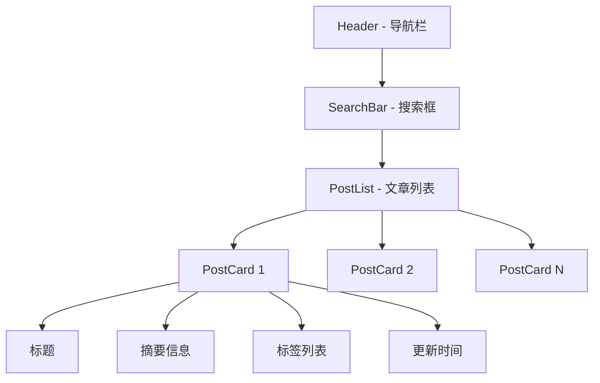

#### 文章详情页布局

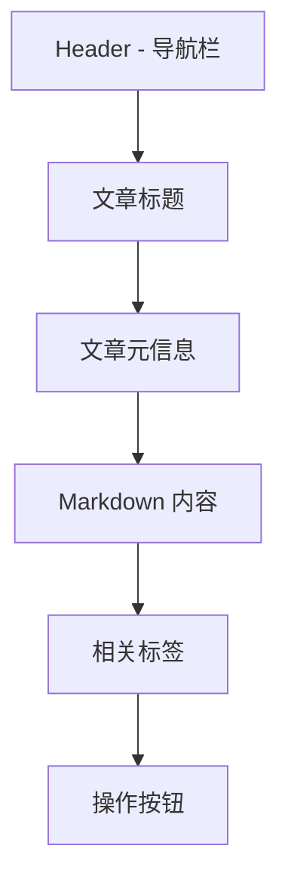

#### 管理后台布局

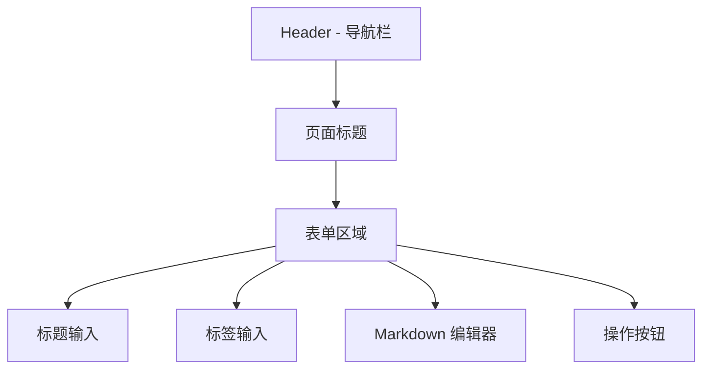

### 响应式设计

#### 断点定义

| 断点 | 屏幕宽度 | 容器最大宽度 |
|------|----------|--------------|
| 手机 | < 640px | 100% |
| 平板 | 640px - 1024px | 768px |
| 桌面 | > 1024px | 768px |

#### 适配策略

**布局适配**
- 移动端：单列布局，全宽显示
- 平板端：限制内容宽度，居中显示
- 桌面端：固定最大宽度，优化阅读体验

**交互适配**
- 移动端：增大点击区域，优化触摸体验
- 桌面端：支持键盘快捷键，hover 效果

## 数据流设计

### 应用状态管理

#### 状态层次结构

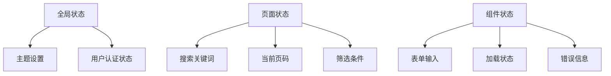

#### 数据获取策略

**服务端渲染 (SSR)**
- 首页文章列表
- 文章详情页
- SEO 优化页面

**客户端获取**
- 搜索结果
- 表单提交
- 实时预览

### API 设计

#### Server Actions

| 操作 | 函数名 | 参数 | 返回值 |
|------|--------|------|--------|
| 创建文章 | `createPost` | FormData | slug string |
| 更新文章 | `updatePost` | id, FormData | void |
| 删除文章 | `deletePost` | id | void |
| 搜索文章 | `searchPosts` | query | Post[] |

#### 数据流向

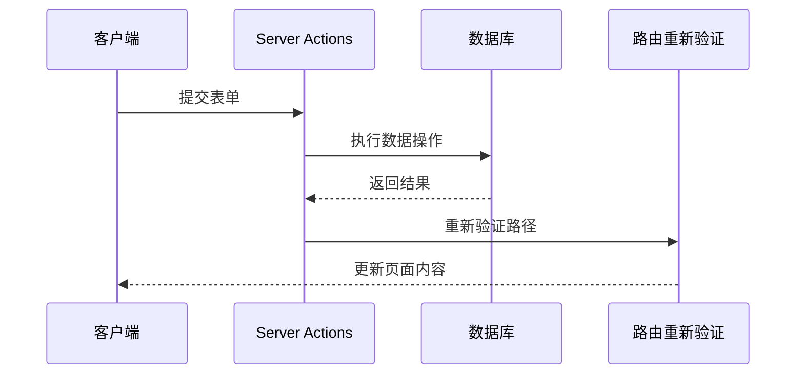

## 部署架构

### 开发环境

#### 本地开发配置

**环境要求**
- Node.js 18+
- npm/yarn/pnpm
- SQLite 数据库文件

**启动流程**
1. 克隆项目代码
2. 安装依赖包
3. 初始化数据库
4. 启动开发服务器

**开发工具链**
- Next.js 开发服务器
- Prisma Studio (数据库管理)
- 热重载和快速刷新

### 生产环境

#### 部署架构图

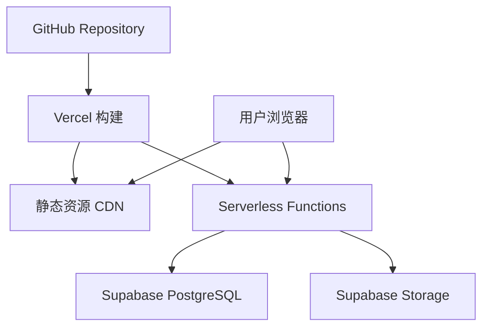

#### 部署配置

**Vercel 配置**
- 自动构建和部署
- 边缘函数支持
- 环境变量管理
- 自定义域名绑定

**数据库配置**
- Supabase/Neon PostgreSQL
- 连接池优化
- 备份策略
- 性能监控

### 迁移策略

#### 从开发到生产

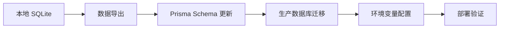

#### 升级路径

**阶段一：MVP 部署**
- Vercel + Supabase 基础配置
- 核心功能验证
- 性能基准测试

**阶段二：功能增强**
- 用户认证集成
- 文件上传功能
- 高级搜索优化

**阶段三：扩展功能**
- RSS 订阅服务
- 评论系统
- PWA 支持
- 性能优化

## 扩展规划

### 用户认证系统

#### NextAuth.js 集成

**认证策略**
- Credentials Provider (用户名/密码)
- GitHub OAuth Provider
- 会话管理和中间件保护

**权限控制**

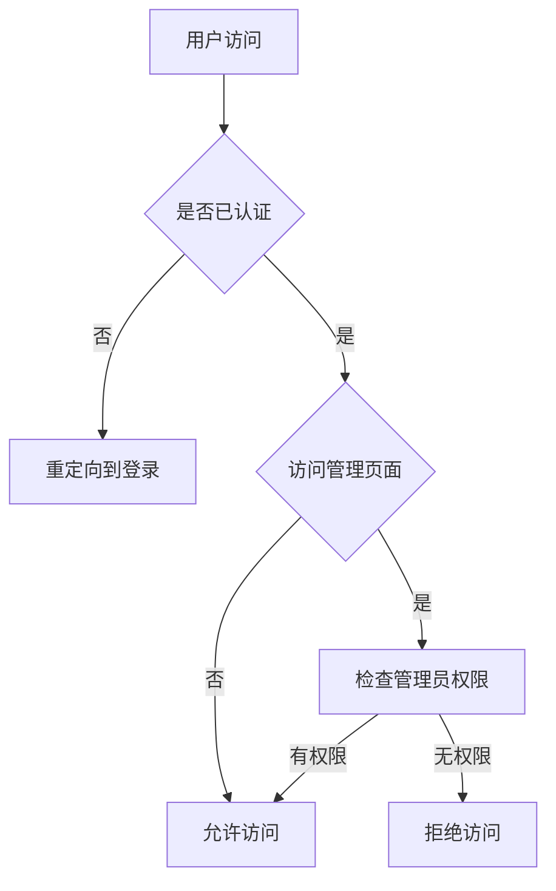

### 文件上传系统

#### Supabase Storage 集成

**上传流程**
1. 客户端获取签名 URL
2. 直接上传到 Supabase Storage
3. 返回文件 URL 插入 Markdown

**文件管理**
- 支持图片、文档等多种格式
- 自动压缩和优化
- 批量上传功能

### 搜索优化

#### 全文搜索方案

**技术选择**
- **Meilisearch**: 高性能搜索引擎
- **Fuse.js**: 轻量级前端搜索
- **PostgreSQL FTS**: 数据库内置全文搜索

**搜索功能增强**
- 智能提示和自动完成
- 搜索结果高亮
- 搜索历史记录
- 高级筛选选项

### 内容增强

#### Markdown 扩展

**图表支持**
- Mermaid 图表渲染
- 数学公式 (KaTeX)
- 代码块增强功能

**编辑器改进**
- 实时预览模式
- 快捷键支持
- 语法高亮
- 自动保存草稿

#### RSS 和 SEO

**RSS 功能**
- 自动生成 RSS Feed
- 订阅管理界面
- 更新通知机制

**SEO 优化**
- 自动生成 sitemap
- Open Graph 标签
- 结构化数据标记
- 页面性能优化


